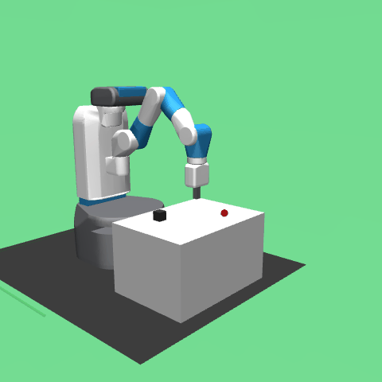

# panda-pick

[](https://github.com/gw1n/panda-pick/actions/workflows/build_and_test.yml)
[](https://github.com/gw1n/panda-pick/actions/workflows/sim_evaluation.yml)

A Franka Panda arm trained end-to-end with reinforcement learning to pick and place objects, deployed through ROS2, with a CI/CD pipeline that runs headless evaluation on every commit.

## What this is

The project has three parts that fit together:

**RL training.** A SAC agent with Hindsight Experience Replay learns the pick-and-place task in MuJoCo simulation. HER is necessary here because the reward is sparse — the agent only gets feedback when the object actually reaches the goal. Without it, learning stalls. With it, failed trajectories get retroactively relabeled as successful ones by substituting the achieved state as the goal.

**ROS2 deployment.** The trained policy is exported to ONNX with VecNormalize normalization baked into the graph, then loaded into a ROS2 node. Three nodes communicate over topics: `sim_bridge` runs MuJoCo and publishes observations, `policy_node` runs inference and publishes actions, `evaluation_node` orchestrates episodes and writes a metrics report.

**CI/CD.** GitHub Actions runs two workflows on every push: one builds the ROS2 package and runs tests, another loads the ONNX policy and evaluates it over 50 headless episodes. If success rate drops below 0.4, the workflow fails. A third workflow publishes Docker images to GHCR on version tags.

MuJoCo was chosen over Isaac Sim because GitHub Actions runners are CPU-only. Isaac Sim requires an NVIDIA GPU.

## Stack

| Area | Tools |
|---|---|
| Simulation | MuJoCo via `gymnasium-robotics` (FetchPickAndPlace-v4) |
| RL algorithm | SAC + HER, Stable-Baselines3 |
| Policy export | ONNX (normalization baked in) |
| Robot framework | ROS2 Humble |
| Containerization | Docker, Docker Compose |
| CI/CD | GitHub Actions |
| Training monitoring | Weights & Biases |

## Results

Trained for 1M steps on CPU. Evaluated with a fixed seed over 50 episodes.

| Metric | Value |
|---|---|
| Success rate (ONNX eval, 50 episodes) | 0.54 |
| Success rate (via ROS2 nodes, 10 episodes) | 0.70 |
| CI regression threshold | 0.40 |



## Getting started

**Training:**

```bash
cd docker
docker compose build train
docker compose run --rm train python rl/train.py --no-wandb
```

Pause with Ctrl+C — state is saved to `models/paused_state/`. Resume:

```bash
docker compose run --rm train python rl/train.py --resume --no-wandb
```

**Export and evaluate:**

```bash
docker compose run --rm train python rl/export_onnx.py
docker compose run --rm evaluate python rl/evaluate.py --success-threshold 0.4
```

**ROS2 evaluation (all three nodes):**

```bash
docker compose build ros2
docker compose run --rm ros2
```

**Record a demo GIF** (requires local Python with `imageio`, `onnxruntime`, `gymnasium-robotics`):

```bash
pip install imageio onnxruntime gymnasium gymnasium-robotics
python scripts/record_demo.py --output results/demo.gif
```

## Repository layout

```
.
├── .github/workflows/
│   ├── build_and_test.yml     # colcon build + pytest on every push
│   ├── sim_evaluation.yml     # headless eval, artifact upload, regression gate
│   └── docker_publish.yml     # push images to GHCR on version tags
├── docker/
│   ├── Dockerfile.train       # python:3.10-slim + MuJoCo + SB3
│   ├── Dockerfile.ros2        # ros:humble + onnxruntime + MuJoCo
│   └── docker-compose.yml
├── rl/
│   ├── train.py               # SAC + HER, pause/resume via SIGINT
│   ├── evaluate.py            # headless ONNX evaluation, writes metrics.json
│   ├── export_onnx.py         # PolicyWrapper: normalization baked into ONNX
│   ├── envs/pick_place_env.py
│   ├── configs/sac_config.yaml
│   └── tests/
├── ros2_ws/src/manipulation_policy/
│   ├── manipulation_policy/
│   │   ├── policy_node.py     # /observation → ONNX → /joint_command
│   │   ├── sim_bridge.py      # MuJoCo ↔ ROS2, dedicated sim thread
│   │   └── evaluation_node.py # episode orchestration, metrics output
│   └── launch/evaluation_launch.py
├── models/
│   ├── policy.onnx            # trained policy (normalization included)
│   └── policy_meta.json       # obs key order and dimensions
└── scripts/record_demo.py
```
